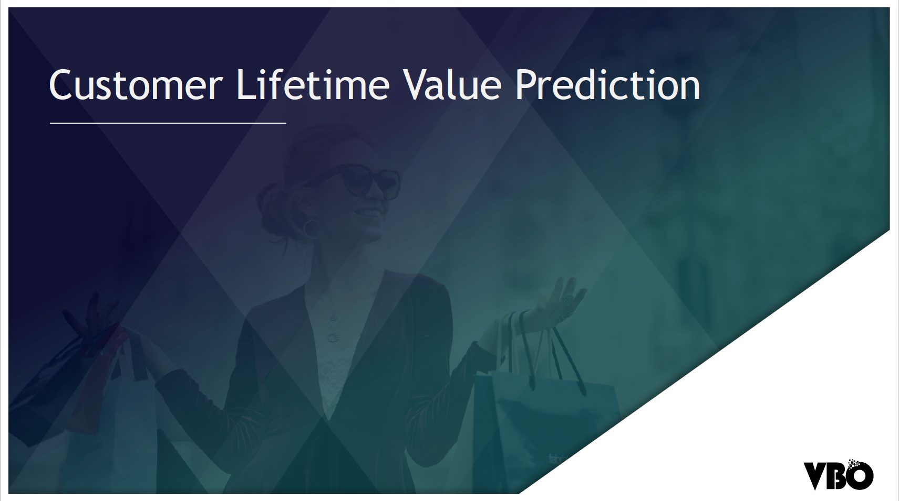

# Customer Lifetime Value Prediction

## Business Problem & Purpose

Predicting Customer Lifetime Values with different ways

Thinking about the important metrics for Customer Lifetime Value

Predict the customers that will bring the most profit to the company 

## Project Steps

- Connect to the database and extract data 

- Customer segmentation with RFM
- Calculation Customer Lifetime Value in basic concept
- Predicting Customer Lifetime Value with BG-NBD & GammaGamma models by adding the concept of time 
- Export tables and forecast outputs of all models to the database 

## Dataset Information

Used Online Retail 2 dataset in this project. 

This dataset contains the purchase values of a wholesale company's customers in UK between 2010-2011. 

## Features

**InvoiceNo**: Unique invoice number. C means refundees.

**StockCode**: Unique item code

**Description**: Item description

**Quantity**: Item quantity number

**InvoiceDate**: Invoice date time

**UnitPrice**: Item price (Sterlin)

**CustomerID**: Unique Customer Number

**Country**: Country name. The country where the customer lives. 

---

### Libraries

```
datetime
pandas
pymysql
sqlalchemy 
sklearn
lifetimes
```

------

### Author

**Oğuz Han Erdoğan** - [oguzerdo](https://github.com/oguzerdo)

------

### Reference:

```
VBO - Data Science and Machine Learning Bootcamp
www.veribilimiokulu.com
```